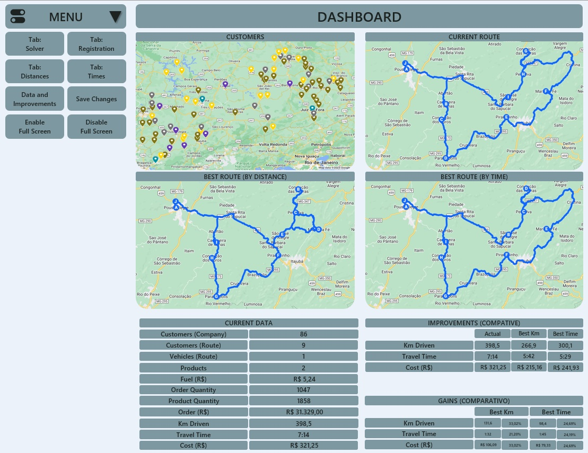
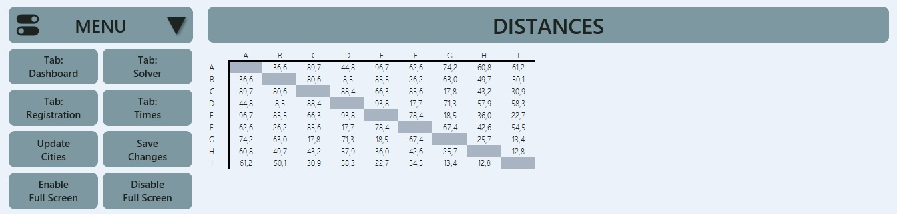
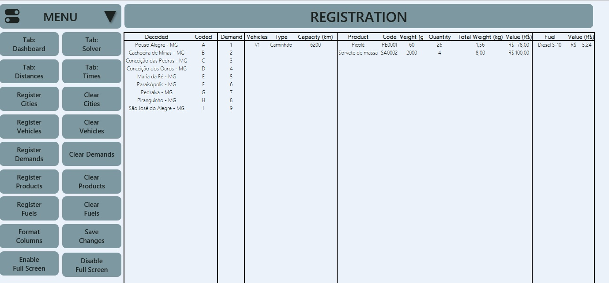
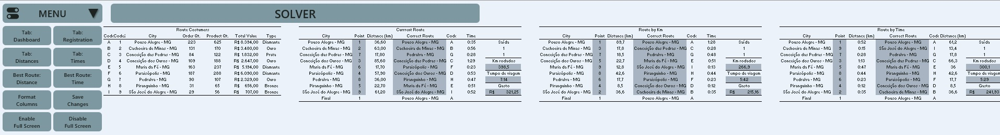
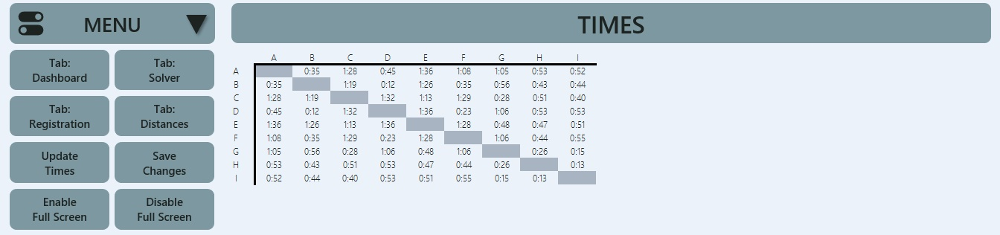

# 🚚 Routing: VBA Code

## 📝 Description

This repository contains VBA code for **Routing Optimization** using a Genetic Algorithm (GA) to optimize routes considering both travel time and distance.

The methodology is discussed in the articles below, and the code is designed to run within Excel. Users can manage the registration of cities, vehicles, demands, products, fuels, and Google Maps or Street View APIs. The tool allows multi-objective optimizations with respect to time and distance, and all calculations and visualizations are performed directly in Excel via VBA.

---

## 🛠️ How to Use

1. **Clone or download** this repository to your local machine.
2. **Open** the Excel file containing the VBA macros.
3. **Enable macros** in Excel.
4. **Run** the desired VBA routines from the VBA editor or assign them to buttons in your Excel sheets.
5. The code includes detailed comments and visual figures to help you understand its functionality.

---

## 📚 Publications

In addition to ongoing manuscripts under review, the following public papers are already available:

- **Optimal route planning with genetic algorithms: A solution for transportation optimization** (*Planejamento de rotas ótimas com algoritmos genéticos: Uma solução para otimização de transporte*)  
  [Read here](https://journals.stellata.com.br/jor/article/view/44/31)
- **Improvement in logistics efficiency through routing optimization of a coffee company in southern Minas Gerais** (*Melhoria na eficiência logística com a otimização de roteirização de uma empresa cafeeira do sul de Minas Gerais*)  
  [Read here](https://www.fai-mg.br/biblio/images/publicacoes/Cientifica/Cientifica2023.pdf#page=49)

---

## 📁 Worksheets Included

| Worksheet      | Description                                                              |
|----------------|--------------------------------------------------------------------------|
| **Dashboard**  | Shows clients, current route, optimized route (distance & time).         |
| **Solver**     | Multi-objective optimization via Genetic Algorithm (GA).                 |
| **Registration**| Register cities, demands, vehicles, products, fuels.                    |
| **Distances**  | Matrix of distances between cities.                                      |
| **Times**      | Matrix of travel times between cities.                                   |

---

## 🖼️ Figures

| Example                | Screenshot                     | Description                          |
|------------------------|--------------------------------|--------------------------------------|
| Dashboard Home         |          | Initial screen of the Dashboard sheet.   |
| Distances Home         |          | Initial screen of the Distances sheet.   |
| Registration Home      |    | Initial screen of the Registration sheet.|
| Solver Home            |                | Initial screen of the Solver sheet.      |
| Times Home             |                  | Initial screen of the Times sheet.       |

---

## ⚙️ Main VBA Routines

Click to expand the list of main routines

- `1. Data and Improvements`
- `2. Best Route: Distance`
- `3. Best Route: Time`
- `4. Register Cities`
- `5. Clear Cities`
- `6. Register Vehicles`
- `7. Clear Vehicles`
- `8. Register Demands`
- `9. Clear Demands`
- `10. Register Products`
- `11. Clear Products`
- `12. Register Fuels`
- `13. Clear Fuels`
- `14. Update Cities`
- `15. Update Times`
- `16. Save Changes`
- `17. Enable Full Screen`
- `18. Disable Full Screen`
- `19. Tab: Solver`
- `20. Tab: Registration`
- `21. Tab: Distances`
- `22. Tab: Times`
- `23. Tab: Dashboard`

---

## 📬 Contact

---

> _Feel free to open issues or PRs, or reach out for collaboration or questions!_
